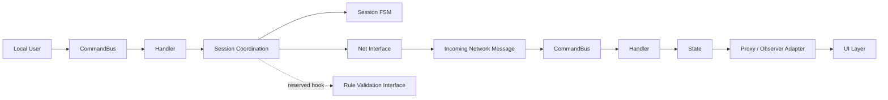
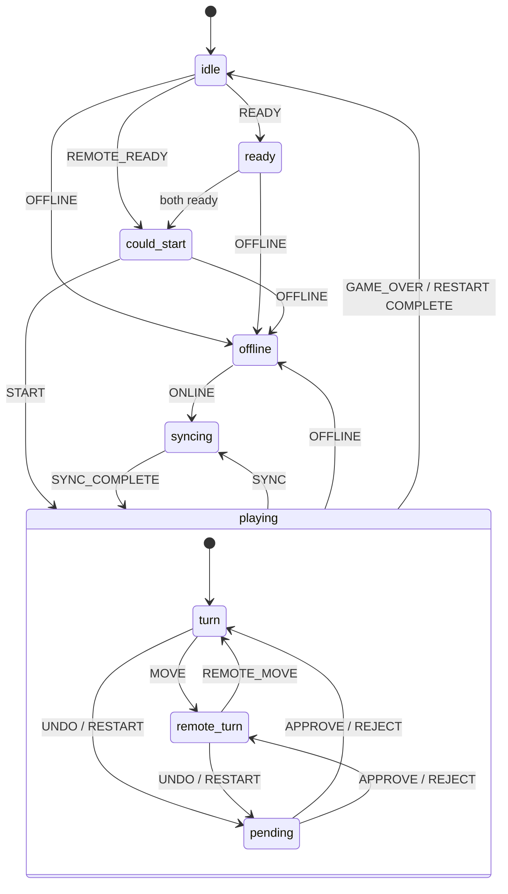

# WebRTC P2P Session Layer

## Project Summary

This project is a lightweight session layer for turn-based WebRTC games. It focuses on lockstep synchronization between two peers and separates command routing, session coordination, state transitions, network transport, and UI feedback.

The implementation is built around a **Command Bus + Session + FSM + Observer/Proxy** design. Local user actions and incoming network messages both go through the same bus-driven pipeline, which keeps the behavior deterministic and easier to extend.

## Key Capabilities

- Built a lightweight **lockstep session layer** for turn-based games over WebRTC.
- Supported **serverless peer-to-peer gameplay** without a dedicated game server.
- Implemented core session actions including **move**, **undo**, and **restart**.
- Added a reserved **rule validation hook** for game-specific legality checks.
- Implemented **offline recovery and synchronization** through reconnect and sync messages.
- Designed the session flow to keep both peers' state consistent during gameplay.

## Architecture

The session layer is divided into the following responsibilities:

- `CommandBus`: receives local commands and remote messages, then routes them to handlers.
- `Handler`: processes each action type and coordinates session logic.
- `Session`: the coordination layer that drives state mutation, FSM transitions, and network sending.
- `SessionFsm`: enforces legal state transitions through a transition table.
- `NetClient`: bridges the session layer and the WebRTC/network layer.
- `State`: stores history, pending actions, turn ownership, reconnect context, and plugin hooks.
- `UINotificationAdapter` / `GameStateObserver`: propagate state changes back to the UI layer.
- `IGamePlugin`: reserved extension point for move validation and win checking.

## Runtime Flow

The main runtime flow is:

1. The local user sends a command.
2. The command enters the `CommandBus`.
3. The bus dispatches the command to the corresponding handler.
4. The handler coordinates the session layer.
5. The session layer drives the FSM and calls the network interface when needed.
6. When a network message is received, it is sent back into the `CommandBus`.
7. The bus routes it again to the handler, and the handler updates `State`.
8. `State` is observed by a proxy/observer adapter, which pushes updates back to the UI.
9. A rule-validation interface is reserved for future game-specific checks.

### Flow Diagram



## State Machine Design

The FSM is based on a transition-table model:

```ts
type Transition = {
  from: SessionState;
  event: SessionEvent;
  to: SessionState;
};
```

This design makes the session behavior explicit and predictable:

- every valid state change is declared in one place,
- handlers can check legality before mutating state,
- and complex flows such as sync or approval can still be resolved in a controlled way.

### Main States

- `idle`: default pre-match state.
- `ready`: local peer is ready.
- `could_start`: the match can start.
- `turn`: local player has the turn.
- `remote_turn`: remote player has the turn.
- `waiting_approval`: waiting for undo/restart approval.
- `approving`: reviewing a peer request.
- `syncing`: recovering session state after reconnect.
- `offline`: disconnected state.

### Simplified State Diagram



### Transition Examples

- `idle + READY -> ready`
- `could_start + START -> turn` or `remote_turn`
- `turn + MOVE -> remote_turn`
- `turn + UNDO -> waiting_approval`
- `offline + ONLINE -> syncing`

These transitions show how the FSM separates pre-match readiness, gameplay,
request approval, and reconnect synchronization.

## Session Envelope and Protocol Design

The session protocol uses a lightweight top-level envelope:

```ts
type SessionMessage = {
  type:
    | 'READY'
    | 'START'
    | 'MOVE'
    | 'UNDO'
    | 'RESTART'
    | 'APPROVE'
    | 'REJECT'
    | 'SYNC_REQUEST'
    | 'SYNC_STATE'
    | 'OFFLINE'
    | 'ONLINE'
    | 'GAME_OVER';
  from?: string;
  seq?: number;
  sid?: string;
  turn?: number;
  stateHash?: string;
  payload?: any;
};
```

### Protocol Field Design

- `type`: identifies the command or control message.
- `from`: identifies the sender.
- `seq`: reserved for ordered delivery or replay protection.
- `sid`: identifies the session.
- `turn`: identifies the current move or logical turn index.
- `stateHash`: reserved for future consistency checks.
- `payload`: action-specific data.

### Protocol Semantics

- `READY` / `START`: control pre-match readiness and match start.
- `MOVE`: carries gameplay actions in lockstep order.
- `UNDO` / `RESTART`: request state-changing operations that may require approval.
- `APPROVE` / `REJECT`: resolve pending requests.
- `SYNC_REQUEST` / `SYNC_STATE`: recover session state after reconnect.
- `OFFLINE` / `ONLINE`: represent connection changes.
- `GAME_OVER`: ends the current match and returns the session to its pre-match state.

### Example Payloads

- `START`: `{ starter: 'sender' | 'receiver' }`
- `UNDO`: `{ count: 1 | 2 }`
- `SYNC_STATE`: `{ history, lastStart, turn, resumeTurn }`
- `GAME_OVER`: `{ winner, turn }`

## Resume Positioning

This project demonstrates practical experience in:

- WebRTC-based peer-to-peer session design,
- lockstep synchronization for turn-based games,
- event-driven architecture with a command bus,
- deterministic FSM-based session control,
- offline recovery and state synchronization,
- observer-based UI feedback,
- and extensible protocol design for future game-rule integration.
